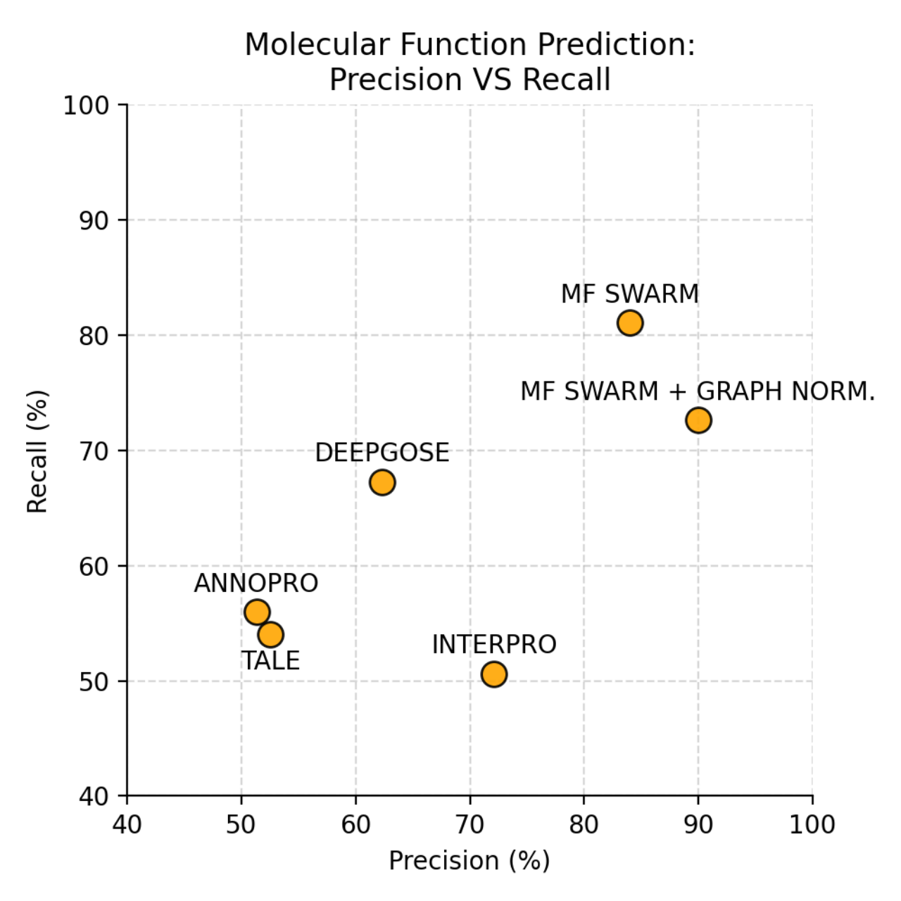

# MF Swarm
A Hierarchical Ensemble Classifier Using Protein Language Models for Enhanced Functional Annotation

## Introduction

Inspired by the success of large language models in areas like natural language processing, researchers have applied similar architectures, notably the Transformer, to protein sequences. Thanks to these developments, Protein Language Models (PLMs) have become important resources for diverse tasks such as predicting protein family, function, solubility, cellular location, molecular interactions and remote homology.

While recent breakthroughs have largely solved protein structure prediction, the task of identifying precise molecular functions still presents a significant bottleneck for bioinformatics.

This task is complicated by the hierarchical, multi-label nature of the Gene Ontology (GO) and a severe class imbalance, where most functions are associated with very few proteins.

Current computational tools often struggle with low precision or sensitivity.

We introduce Molecular Function (MF) Swarm, a new tool (currently in development) that addresses these challenges by combining multi-modal inputs with a hierarchical classification strategy.

The architecture is an ensemble of 27 classifiers, each trained as a 5-fold cross-validation committee, implementing an adapted "Local Classifier Per Level" strategy. This segmented approach groups functions by both their depth in the GO hierarchy and annotation frequency, creating specialized classifiers to manage the "long-tail" data imbalance.

## Comparison to Other Automatic Function Prediction Software

- Preliminary results for the prediction of 1320 molecular functions show state-of-the-art performance, achieving an AUPRC of 79% and an Fmax of 84%;
- We also tested normalization strategies and found that applying a graph-based post-processing step can push precision to 90%. Although this comes at a cost of sensitivity, it provides a valuable, flexible trade-off for researchers who may require high-confidence predictions;
- MF Swarm significantly outperforms existing, publicly available tools like DeepGO SE, TALE+, AnnoPRO and InterProScan in validation tests;
- As development continues, MF Swarm aims to provide an accurate, accessible, and easily executable tool to aid functional annotation, biomedical research, and the pharmacological analysis of novel proteins/

### Statistics and Total of Molecular Functions of Functional Annotation Software

| **Software** | **AUPRC** |   **Fmax**   | **Number of Molecular Functions** |
|:------------:|:---------:|:------------:|:---------------------------------:|
|    AnnoPRO   |   39,16   |     49,19    |                939                |
|     TALE+    |    41,8   |     52,63    |                6026               |
| InterProScan |   35,67   |     53,35    |                1662               |
|   DeepGO SE  |   56,35   |     64,23    |                6773               |
|   MF Swarm   |   79,81   |     84,01    |                1320               |
|    Totais    |   95,41   | 13,6 a 14,85 |                                   |



## Deep Learning Architecture


## Benchmarking of PLM Models
```sh
mamba env crete -f mf_swarm_base.yml
conda run --live-stream -n mf_swarm_base pip3 install torch torchvision torchaudio --index-url https://download.pytorch.org/whl/cpu
python src/base_benchmark.py ~/data/dimension_db 1 ~/data/mf_datasets 30 0.1
```


## Training MF Swarm

### Dataset Creation

Tests the training with a few nodes:

```sh
nextflow run main.nf -resume --exp_config config/experiment/full_swarm/small_test.json --exp_name new_dataset_nf
```